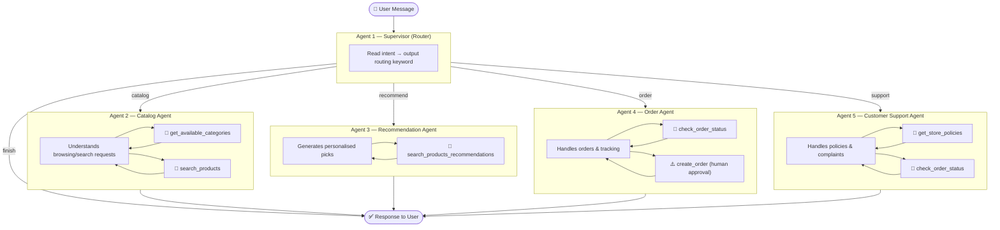
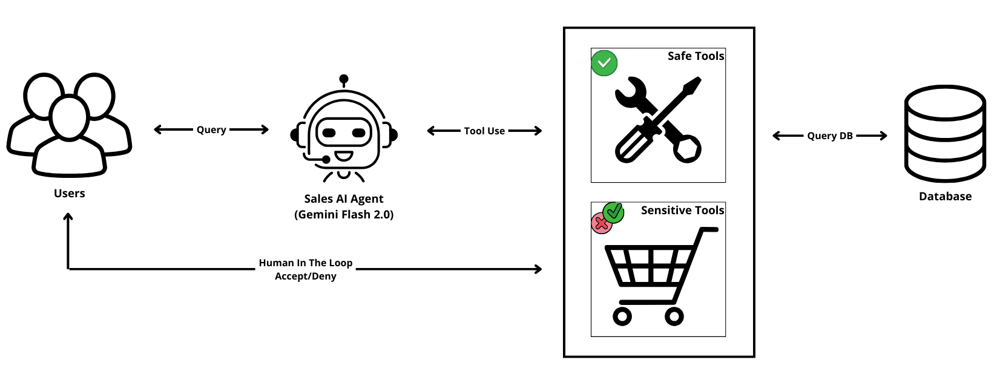
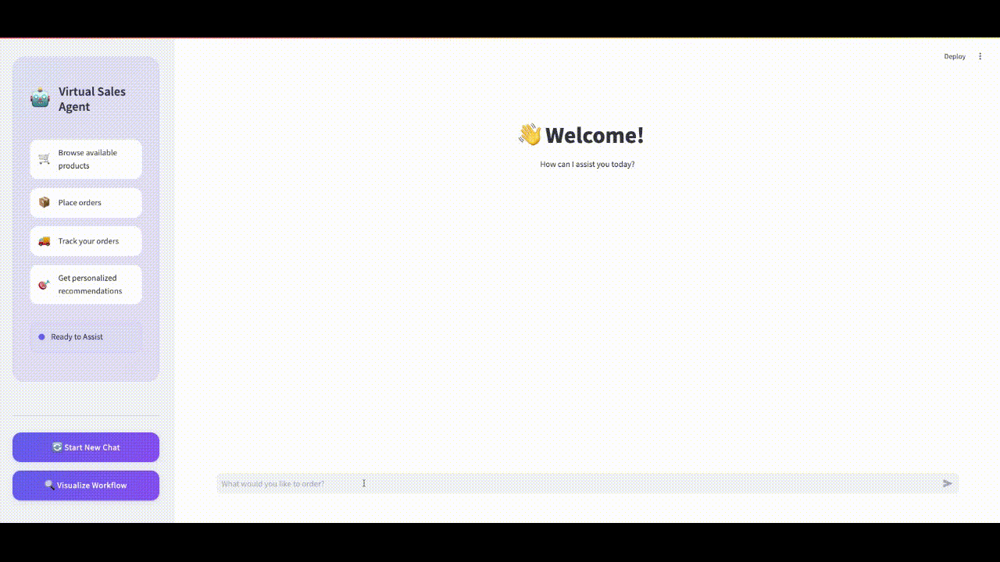
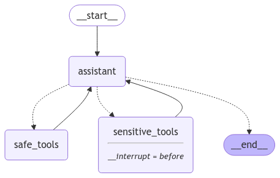

# Virtual Sales Agent powered by LangGraph, Streamlit & Gemini

This project implements a **multi-agent Virtual Sales Assistant** built with **LangGraph**, **LangChain**, **Gemini AI**, and a SQLite database. The system routes every customer message through a **Supervisor Agent** which delegates to one of four specialist agents — each with its own dedicated tools.

Sensitive actions (like placing orders) include a **human-in-the-loop** approval step before execution.

---

## Table of Contents
1. [How It Works](#how-it-works)
2. [Agent Architecture](#agent-architecture)
3. [Key Features](#key-features)
4. [Built With](#built-with)
5. [Project Structure](#project-structure)
6. [Interface Preview](#interface-preview)
7. [Get Started](#get-started)
8. [Contributing](#contributing)
9. [Related Resources](#related-resources)
10. [License](#license)

---

## How It Works

Every user message follows this flow:

```
User Message
     │
     ▼
┌─────────────────────────────────────────────────┐
│              AGENT 1 — SUPERVISOR               │
│  Reads user intent and routes to the right      │
│  specialist. No tools — pure routing logic.     │
└───────┬──────────┬────────────┬─────────────────┘
        │          │            │            │
        ▼          ▼            ▼            ▼
  ┌──────────┐ ┌──────────┐ ┌────────┐ ┌──────────┐
  │ AGENT 2  │ │ AGENT 3  │ │AGENT 4 │ │ AGENT 5  │
  │ Catalog  │ │  Recom-  │ │ Order  │ │ Customer │
  │  Agent   │ │ mendation│ │ Agent  │ │ Support  │
  │          │ │  Agent   │ │        │ │  Agent   │
  └────┬─────┘ └────┬─────┘ └───┬────┘ └────┬─────┘
       │             │           │            │
  get_available  search_products  check_order  get_store
  _categories    _recommendations _status     _policies
  search_products                 create_order check_order
                                  ⚠️ human    _status
                                  approval
```

### Step-by-step

1. **User sends a message** via the Streamlit chat interface.
2. **Supervisor Agent** (Agent 1) reads the message and outputs one routing keyword:
   - `catalog` → browse/search products
   - `recommend` → personalised picks
   - `order` → place or track orders
   - `support` → policies, complaints, FAQs
3. **Specialist Agent** receives the message and calls its tools to fulfil the request.
4. For **order creation** specifically, the graph **pauses** and waits for the human to confirm before proceeding (`interrupt_before=["order_sensitive_tools"]`).
5. The specialist agent's response is returned to the user.

---

## Agent Architecture



### Agent Responsibilities

| # | Agent | Role | Tools |
|---|-------|------|-------|
| 1 | **Supervisor** | Routes the user's message to the right specialist | — |
| 2 | **Catalog Agent** | Browse categories, search products by name/price/category | `get_available_categories`, `search_products` |
| 3 | **Recommendation Agent** | Suggest personalised products based on preferences | `search_products_recommendations` |
| 4 | **Order Agent** | Place orders (with human approval) and check order status | `create_order` ⚠️, `check_order_status` |
| 5 | **Customer Support Agent** | Answer FAQs, explain policies, resolve complaints | `get_store_policies`, `check_order_status` |

> ⚠️ `create_order` is a **sensitive tool** — the graph pauses and requires the human to approve the action before it executes.

---

## Key Features

- **Multi-agent routing** — each specialist is focused on one domain only
- **Human-in-the-loop** — order placement requires explicit user approval
- **5 specialist tools** — catalog search, recommendations, order management, policy lookup
- **Persistent memory** — conversation state is maintained across turns using LangGraph's `MemorySaver`
- **Streamlit UI** — clean chat interface with sidebar controls

---

## Built With

- **[LangGraph](https://langchain-ai.github.io/langgraph/)** — stateful multi-agent orchestration
- **[LangChain](https://python.langchain.com/)** — LLM tooling and prompt templates
- **[Gemini 2.0 Flash Lite](https://aistudio.google.com/)** — fast and cost-effective LLM by Google
- **[Streamlit](https://streamlit.io)** — interactive web UI
- **[SQLite](https://www.sqlite.org/)** — lightweight local database for products and orders

---

## Project Structure

```
.
├── assets/
│   ├── agent_workflow.png                 # Agent workflow diagram
│   ├── demo.gif                           # Demo GIF
│   ├── graph.png                          # LangGraph compiled graph image
│   └── style.css                          # Streamlit custom styling
├── database/
│   ├── db/
│   │   ├── products.json                  # Initial product seed data
│   │   ├── schemas.sql                    # SQL schema definitions
│   │   └── store.db                       # SQLite database (auto-generated)
│   ├── __init__.py
│   ├── config.py                          # Database configuration
│   └── db_manager.py                      # Database operations
├── virtual_sales_agent/
│   ├── agents/                            # One file per specialist agent
│   │   ├── __init__.py
│   │   ├── supervisor.py                  # Agent 1 — routing supervisor
│   │   ├── catalog.py                     # Agent 2 — product catalog
│   │   ├── recommendation.py              # Agent 3 — recommendations
│   │   ├── order.py                       # Agent 4 — order management
│   │   └── support.py                     # Agent 5 — customer support
│   ├── __init__.py
│   ├── graph.py                           # Assembles the LangGraph state machine
│   ├── llm.py                             # Shared LLM instance + env setup
│   ├── state.py                           # Shared State TypedDict
│   ├── tools.py                           # All LangChain tools
│   └── utils.py                           # Agent class + tool node helpers
├── __init__.py
├── .env                                   # API keys (not committed)
├── env-example                            # Environment variables template
├── main.py                                # Streamlit entry point
├── README.md                              # This file
├── requirements.txt                       # Python dependencies
└── setup_database.py                      # Database initialisation script
```

---

## Interface Preview

1. **Chat Interface** — clean Streamlit chat with agent status indicator
2. **Human-in-the-Loop** — order placement shows a confirmation step before executing

---

## Get Started

### Prerequisites
- Python 3.12 or later
- A [Google AI Studio](https://aistudio.google.com/apikey) API key (personal Gmail account recommended)
- A [LangSmith](https://smith.langchain.com/) API key (optional, for tracing)

### Installation

1. **Clone the repository:**
   ```bash
   git clone https://github.com/lucasboscatti/sales-ai-agent-langgraph.git
   cd sales-ai-agent-langgraph-main
   ```

2. **Create and activate a virtual environment:**
   ```bash
   python -m venv .venv
   .venv\Scripts\activate        # Windows
   source .venv/bin/activate     # Linux / Mac
   ```

3. **Install dependencies:**
   ```bash
   pip install -r requirements.txt
   ```

4. **Configure environment variables:**
   - Copy `env-example` to `.env`
   - Fill in your keys:
     ```
     GOOGLE_API_KEY=AIza...
     LANGCHAIN_API_KEY=lsv2_...
     LANGCHAIN_TRACING_V2=true
     LANGCHAIN_ENDPOINT=https://api.smith.langchain.com
     LANGCHAIN_PROJECT=virtual-sales-agent
     ```

5. **Initialise the database:**
   ```bash
   python setup_database.py
   ```

6. **Run the app:**
   ```bash
   .venv\Scripts\python.exe -m streamlit run main.py --server.port 8888
   ```
   Open **http://localhost:8888** in your browser.

---

## Contributing

1. Fork the repository and create a feature branch.
2. Follow Python best practices (PEP 8).
3. Submit a pull request with a clear description of your changes.
4. For bugs or feature requests, open an issue.

---

## Related Resources

- [LangChain Documentation](https://python.langchain.com/docs/introduction/)
- [LangGraph Documentation](https://langchain-ai.github.io/langgraph/tutorials/introduction/)
- [Streamlit Documentation](https://docs.streamlit.io)
- [Google Gemini API](https://aistudio.google.com/)
- [LangSmith Tracing](https://smith.langchain.com/)

---

## License

This project is licensed under the MIT License. See the [LICENSE](LICENSE) file for more details.

---


This project implements a **Virtual Sales Agent** that simulates customer interactions, providing information and support through a Streamlit interface. Using the power of **LangChain**, **LangGraph**, and a SQLite database, this agent can answer product questions, create orders, check order statuses, and offer personalized recommendations. These tools are divided into safe and sensitive categories. For sensitive tools, such as creating orders, a human-in-the-loop mechanism is implemented, requiring approval or denial before proceeding.

👉 Check out a quick demo of the Virtual Sales Agent in action in the [Interface Preview](#interface-preview) section!



---

## Table of Contents
1. [Key Features](#key-features)
2. [Built With](#built-with)
3. [Use Cases](#use-cases)
4. [Project Structure](#project-structure)
5. [Interface Preview](#interface-preview)
6. [Get Started](#get-started)
7. [Contributing](#contributing)
8. [Related Resources](#related-resources)
9. [Future Plans](#future-plans)
10. [License](#license)

---

## Key Features

This virtual sales agent can assist customers with:

1. **Product Inquiries:**
   - Answer questions about product availability, pricing, and stock levels.
   - **Example Questions:**
     - "What products do you have in stock?"
     - "How much does product X cost?"
     - "Is product Y available?"

2. **Order Placement:**
   - Allow customers to create new orders, referencing data from the database.
   - **Example Request:** "I would like to order 2 units of product Z."

3. **Order Tracking:**
   - Provide up-to-date status information for existing orders.
   - **Example Question:** "What is the status of order #54321?"

4. **Personalized Recommendations:**
   - Suggest relevant products based on a customer's past purchase history.
   - **Example Recommendation:** "Based on your previous order, you might also like product A."

---

## Use Cases

This Virtual Sales Agent is ideal for:
- **E-commerce websites** to streamline customer service and increase sales.
- **Customer support teams** looking to automate routine tasks while maintaining user control.
- **Sales teams** to recommend personalized products based on purchase history.

---

## Built With

- **LangChain:** Provides the framework for developing AI-powered conversational applications.
- **LangGraph:** Enables the creation of sophisticated, stateful agent workflows.
- **SQLite:** A lightweight database for managing product data and orders.
- **Streamlit:** Facilitates the development of interactive web applications for the agent interface.
- **Gemini Flash 2.0:** A fast and efficient large language model from Google for natural language understanding.

---

## Project Structure

Here's a breakdown of the project's directory structure:

```
.
├── assets/
│   ├── agent_workflow.png    # Diagram
│   ├── demo.gif              # Demo gif
│   ├── graph.png             # Agent workflow diagram
│   └── style.css             # Streamlit custom styling
├── database/
│   ├── db/
│   │   ├── products.json         # Bot product data (initial)
│   │   └── schemas.sql           # SQL schema definitions
│   ├── db_manager.py             # Handles database interactions
│   └── config.py                 # Database connection configuration
├── virtual_sales_agent/
│   ├── graph.py                  # LangGraph agent state machine and logic
│   ├── tools.py                  # Custom tools used by the agent
│   └── utils_functions.py        # Utility functions for the agent
├── env-example                   # Environment variables template
├── main.py                       # Main Streamlit app
├── README.md                     # This file!
├── requirements.txt              # Project dependencies
└── setup_database.py             # Script to initialize the database
```

---

## Interface Preview

1. **🎥 Demo GIF**
   Here's a quick demonstration of the Virtual Sales Agent in action:
   - **Main Interface:** A clean and intuitive chatbot interface that interacts with customers to answer queries and perform tasks.
   - **Human-in-the-Loop Approval System:** A mechanism where sensitive actions, like order creation, require user approval. Users can review the action details and provide feedback for continuous improvement.

   

2. **LangGraph Workflow**

    
    
---

## Get Started

Follow these steps to set up and run the Virtual Sales Agent:

### Prerequisites

- Ensure you have **Python 3.12 or later** installed on your machine.
- We recommend using a virtual environment for managing dependencies.

### Installation Steps

1. **Clone the Repository:**
   ```bash
   git clone https://github.com/lucasboscatti/sales-ai-agent-langgraph.git
   cd virtual-sales-agent
   ```

2. **Create a Virtual Environment:**
   ```bash
   python3 -m venv venv
   source venv/bin/activate    # Linux/Mac
   venv\Scripts\activate       # Windows
   ```

3. **Install Dependencies:**
   ```bash
   pip install -r requirements.txt
   ```

4. **Environment Configuration:**
   - Rename the `.env-example` file to `.env`.
   - Set up your API keys:
     - **Google Gemini Flash:** Requires a `GOOGLE_API_KEY`, along with your `GOOGLE_APPLICATION_CREDENTIALS` (path to your credentials file), `GCP_PROJECT_ID` and `REGION`. Obtain these from your Google Cloud Platform (GCP) account at [Google AI Studio](https://aistudio.google.com/).
     - **LangSmith:** Create a [LangSmith](https://smith.langchain.com/) account and get your `LANGCHAIN_API_KEY`. This is for monitoring and debugging agent interactions.
   - Load environment variables:
     ```bash
     source .env
     ```

5. **Initialize the Database:**
   ```bash
   python3 setup_database.py
   ```

6. **Launch the Streamlit App:**
   ```bash
   streamlit run main.py
   ```

   This will open the application in your web browser, and you can start interacting with the Virtual Sales Agent.

---

## Contributing

We welcome contributions to improve this project! Here’s how you can help:
1. Fork the repository and create a feature branch.
2. Follow Python best practices (e.g., PEP 8).
3. Submit a pull request with a clear description of your changes.
4. For bug reports or feature requests, please open an issue.

---

## Related Resources

- [LangChain Documentation](https://python.langchain.com/docs/introduction/)
- [LangGraph Documentation](https://langchain-ai.github.io/langgraph/tutorials/introduction/)
- [Streamlit Documentation](https://docs.streamlit.io)
- [Google Gemini Flash](https://aistudio.google.com/)

---

## Future Plans

- Fuzzy logic for product names matching

---

## License

This project is licensed under the MIT License. See the [LICENSE](LICENSE) file for more details.

---